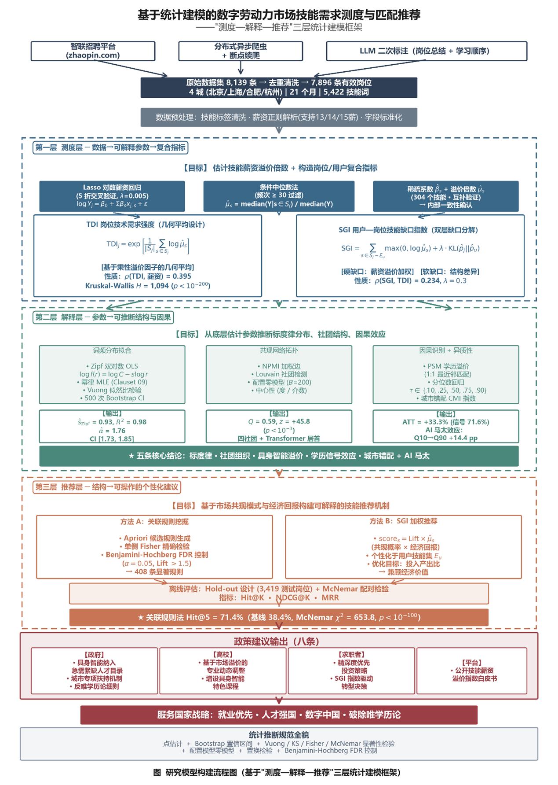
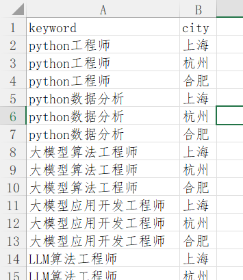
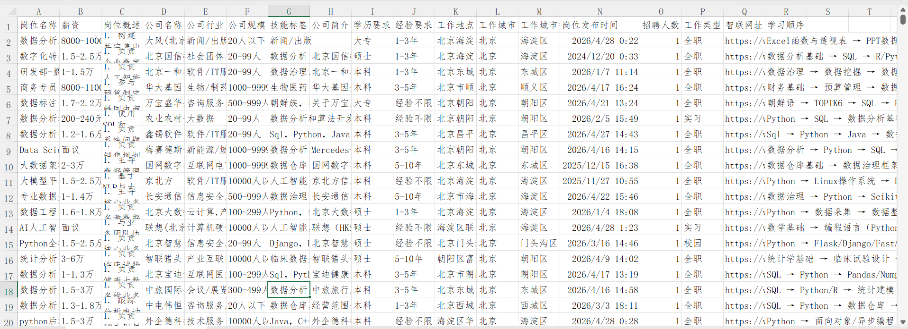

# 智联招聘岗位智能爬虫与AI分析系统

一个自动化采集智联招聘岗位信息、结合大模型（Qwen）进行智能分析的Python项目。支持断点续爬、反爬规避、多模型轮转、AI生成岗位核心总结与学习路径，助力简历优化、技能分析、快速学习与求职决策。

- **全自动爬虫**：支持多城市、多关键词任务配置，自动翻页、去重、断点续爬
- **智能AI分析**：调用通义千问（Qwen）大模型，自动生成**岗位核心职责总结**和**系统化学习路径**
- **反爬健壮性**：随机User-Agent、延时、浏览器指纹伪装、登录弹窗自动关闭
- **模型轮转机制**：自动检测配额耗尽并切换Qwen模型，确保长时间稳定运行
- **数据清洗与技能库**：支持岗位技能词频统计，生成求职技能地图
- **生产级设计**：进度持久化、异常恢复、实时CSV追加
这个爬虫是论文中的数据获取部门，下面是我们论文的技术路线图↓


## 🎯 核心功能

1. **岗位数据采集**
   - 实时抓取岗位名称、薪资、技能标签、描述、公司信息等20+字段
   - 正则精准提取页面内嵌JSON数据

2. **AI智能分析**
   - 生成精炼的**岗位总结**（有序列表，最多10点）
   - 自动生成**学习顺序**（技能链路，从基础到进阶）

3. **数据管理**
   - 标准化URL去重
   - 断点续爬（记录页码+条目索引）
   - 多任务并行支持（通过CSV配置）

## 🛠 技术栈

- **爬虫**：Selenium + Chrome/Edge Driver
- **AI**：阿里通义千问（Qwen系列多模型轮转）
- **数据处理**：Pandas、CSV、JSON、正则
- **持久化**：JSON进度文件 + UTF-8-sig CSV
- **其他**：随机延时、浏览器指纹伪装

## 📁 项目结构

|
├── 1pachong.py              # 主爬虫程序（带模型轮转）
├── 2技能分析.py                 # 技能词频统计
├── 2数据清洗_if1失败.py         # 批量AI后处理脚本
├── wantjob.csv                 # 任务配置文件（关键词+城市）
├── job_analysis_results_.csv   # 输出结果
├── scrape_progress.json        # 爬虫进度
└── README.md


## 开始

### 设定要查找的关键词和城市
在wantjob.csv中设定城市和岗位关键词

可以写很多不同的，这个等于是搜索框要搜的关键词

### 随后爬虫开始抓取
爬虫主要使用的是selenium库，有进程json记录，可以实现断点续爬.
```
# 定义需要提取的字段及其在网页源码 JSON 中的 key
   keys_to_extract = {
         "岗位名称": "positionName",
         "薪资": "salary",
         "岗位概述": "jobDesc",
         "公司名称": "companyName",
         "公司行业": "industryNameLevel",
         "公司规模": "companySize",
         "技能标签": "skillLabel",
         "公司简介": "companyDescription",
         "学历要求": "education",
         "经验要求": "positionWorkingExp",
         "工作地点": "workAddress",
         "工作城市": "positionWorkCity",
         "工作城市行政区": "positionCityDistrict",
         "岗位发布时间": "positionPublishTime",
         "招聘人数": "recruitNumber",
         "工作类型": "workType",
   }
```


### 大模型生成岗位总结和最短学习顺序
读取job detail导入llm理解
代码设置了模型池，如果有免费api和免费model可以用，能够实现一个免费额度用完之后自动切换到另外一个模型，节约人工切模型的时间

```
"""利用 Qwen 模型进行岗位要求分析及岗位描述总结，输出结构化的语言与总结"""
    prompt = f"""
        你是一位专业的招聘数据分析师。请分析以下职位信息，并严格按照下方"输出格式"提供分析结果。

        ### 参考示例
        输入：岗位名称: Python后端工程师; 技能标签: Python,Flask,SQLAlchemy,Pandas; 原始描述: 负责后端API开发...
        输出：
        【岗位总结】: 负责后端服务开发与维护，处理业务逻辑与数据交互。
        【学习顺序】: Python → Flask → SQLAlchemy → Pandas → RESTful API → 数据库设计

        ### 待分析内容
        岗位名称: {job_info.get('岗位名称', '')}
        经验要求: {job_info.get('经验要求', '')}
        公司规模: {job_info.get('公司规模', '')}
        技能标签: {job_info.get('技能标签', '')}
        原始描述: {job_info.get('岗位概述', '')}

        任务：
        请严格按照以下格式提供分析（不要包含任何前言或多余说明）：
        【岗位总结】: (请凝练总结该岗位的核心职责。若原文有分点，请保持简明的有序列表 1. 2. 3. ...形式，并且写完一个点就换行，中间不要有空行。最多不超过10个点。)
        【学习顺序】: (基于技能标签，用 " → " 连接简练的知识点，体现从基础到进阶的逻辑，例如：Python → Flask → SQLAlchemy → Pandas → RESTful API → 数据库设计)
    """
```

生成示例：
```
text【岗位总结】:
1. 负责Python后端接口开发与维护。
2. 参与微服务架构设计及性能优化。

【学习顺序】:
Python → FastAPI/Flask → MySQL/PostgreSQL → Redis → Docker → Kubernetes
```

导出的excel效果：

学习顺序指的是推荐的最短学习路线。例如该岗位要求应聘人同时掌握C语言和Java，那么将会推荐优先学习C语言。

### 关于 `2数据清洗if失败.py` 的用法
如果出了意外，只抓取到网页信息但是llm调用失败了。那么为了节约时间，直接把失败的条目给筛选出来扔进这个脚本单独调用llm进行处理即可。 


### 其他事项
爬虫的配置区域预留了一个接入SQL的接口，但是代码中还没有这个功能。